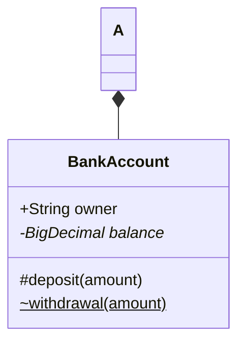

## 事件的工具类

1. 回调函数的封装

主要是作用是处理函数和this之间的关系，防止this的错误绑定。

路径 ：engine-v3.8.2\cocos\core\event\callbacks-invoker.ts

## 全局事件系统

 

```mermaid
classDiagram
    class BankAccount{
        +String owner
        -BigDecimal balance *
        #deposit(amount) 
        ~withdrawal(amount) $
    }
    class A{

    }

    A*--BankAccount

```

## 节点事件系统

